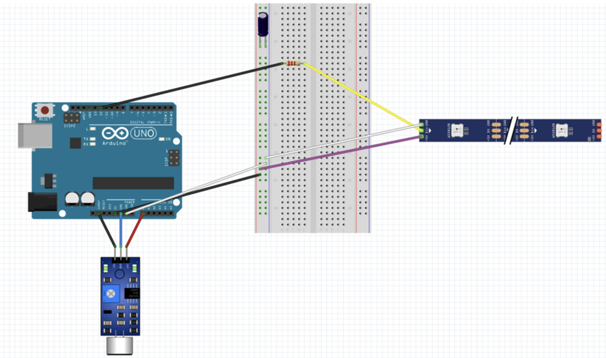
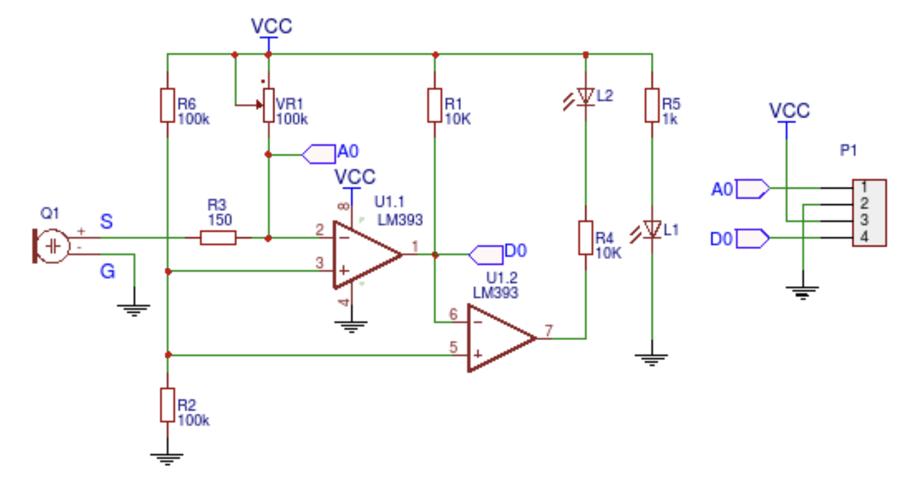
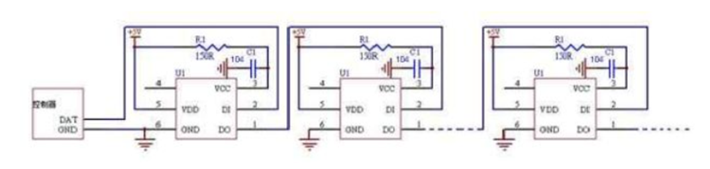

# sound-visualisator-WS2812B

## Used componens:
- Arduino Uno
- Addressable
- Plate
- Sound sensor KY-038
- Resistor 220k Ohm
- Capacitor 100 microF

## How it looks?
https://mega.nz/file/7IcFmQga#v3n3qqqSIZqCBqiWUK5ZjNl_IUoVcjwjkHKrQ70IBkA

## Some schema

`Construction schema`

`Sound sensor`

`LED strip`

